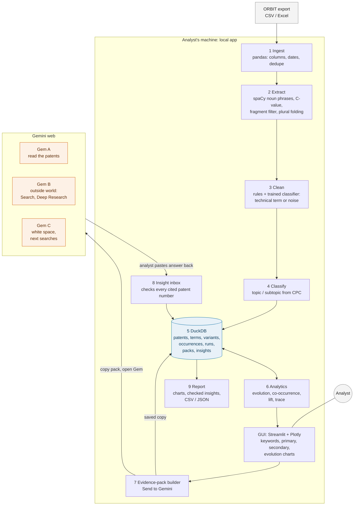
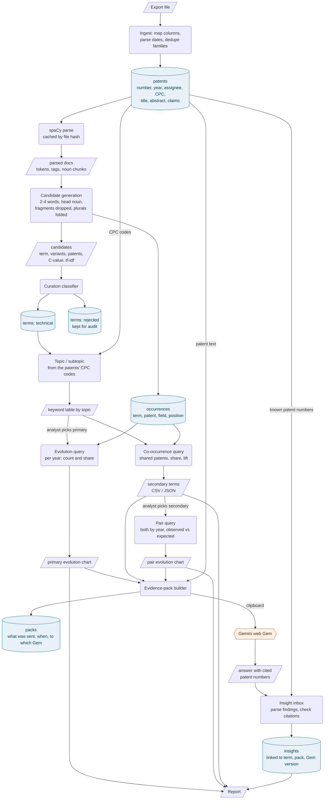
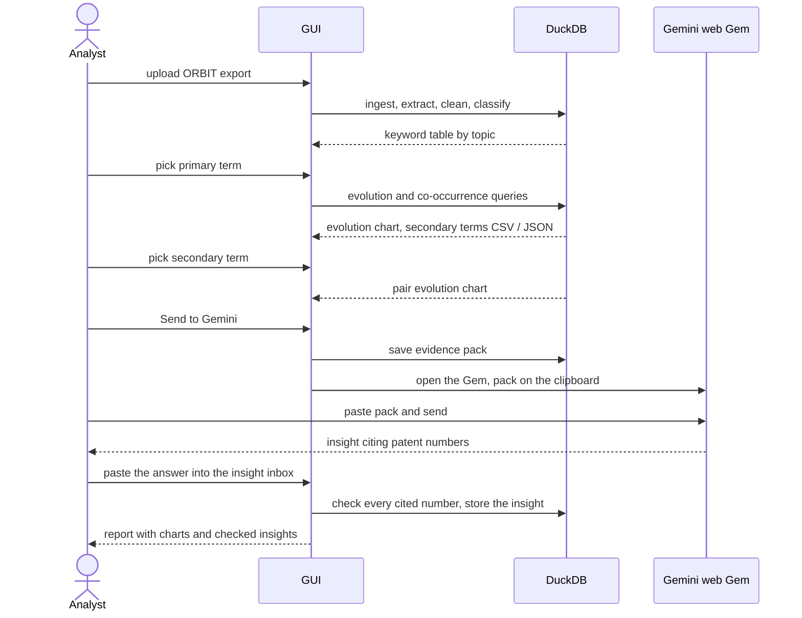

# Architecture: local analysis with Gemini web for intelligence

The proposed next version. Keyword extraction, counting and every chart run
locally with full NLP libraries; Gemini web is used only for reading and
judgment, through Gems the analyst pastes evidence into. Numbers always come
from the local app, and every patent number Gemini cites is checked against
it.

## Architecture

| Local app | Gemini web |
|---|---|
| finds, cleans and classifies terms | reads patent text like an analyst |
| counts: evolution, co-occurrence, lift | explains why: problems, approaches, relationships |
| keeps every number traceable to a patent | brings in companies, products, news |
| checks what Gemini says against the data | suggests gaps and the next searches |

## Dataflow

### One session

## Rules the design keeps

- Numbers come only from the local app; Gemini interprets them.
- Data leaves the machine only when the analyst pastes it, and every pack sent
  is saved.
- A patent number Gemini cites that is not in the export is flagged.
- Rejected terms stay in the data for audit and never become primaries or
  secondaries.
