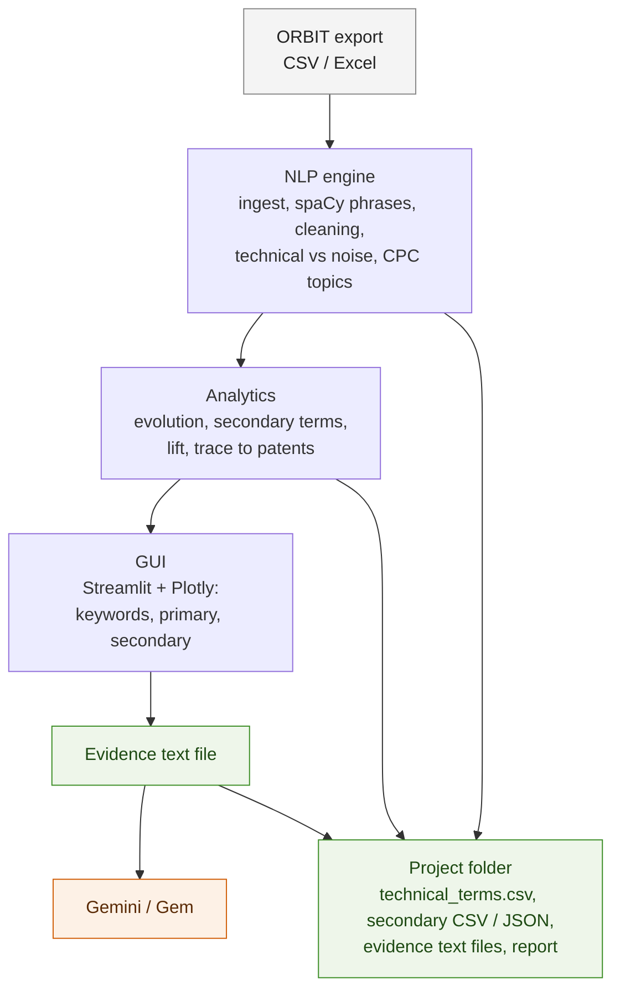
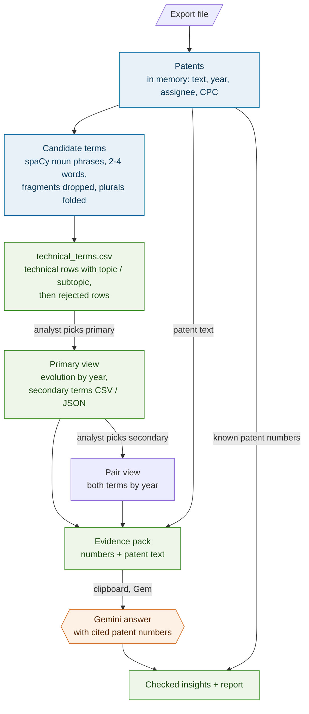
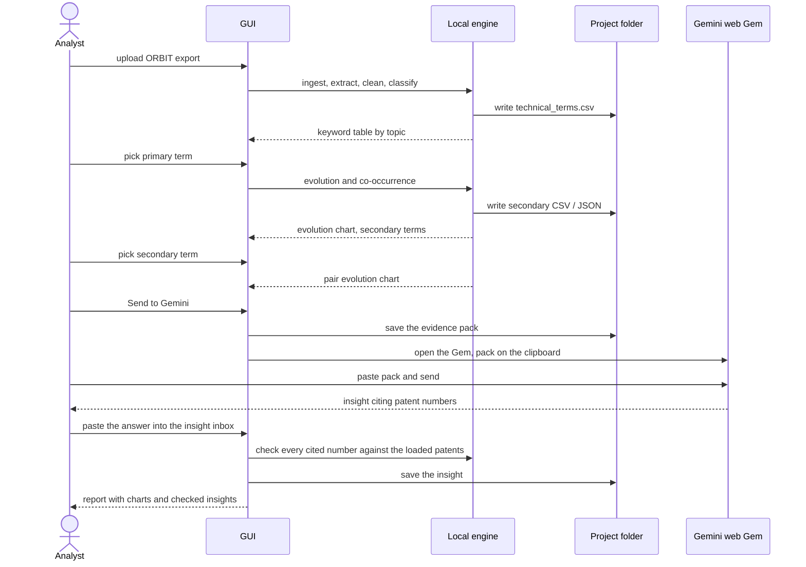

# Architecture: local analysis with Gemini web for intelligence

The proposed next version. Keyword extraction, counting and every chart run
locally with full NLP libraries; Gemini web is used only for reading and
judgment, through Gems the analyst pastes evidence into. Numbers always come
from the local app, and every patent number Gemini cites is checked against
it.

There is no database. While the app runs, the data lives in memory as pandas
tables; everything worth keeping is a plain file in the project folder.
Reopening a project re-reads the export and `technical_terms.csv`.

The Mermaid source of each diagram is also in its own file:
[`diagrams/architecture.mmd`](diagrams/architecture.mmd),
[`diagrams/dataflow.mmd`](diagrams/dataflow.mmd),
[`diagrams/session.mmd`](diagrams/session.mmd).

## Architecture

| Local app | Gemini web |
|---|---|
| finds, cleans and classifies terms | reads patent text like an analyst |
| counts: evolution, co-occurrence, lift | explains why: problems, approaches, relationships |
| keeps every number traceable to a patent | brings in companies, products, news |
| checks what Gemini says against the data | suggests gaps and the next searches |

## Dataflow

Blue lives in memory for the session; green is written to the project folder;
orange comes from Gemini web; the pair view is shown on screen only.

### One session

## Rules the design keeps

- Numbers come only from the local app; Gemini interprets them.
- No database: memory while running, plain files for anything kept.
- Data leaves the machine only when the analyst pastes it, and every pack sent
  is saved in the project folder.
- A patent number Gemini cites that is not in the export is flagged.
- Rejected terms stay at the end of `technical_terms.csv` for audit and never
  become primaries or secondaries.
