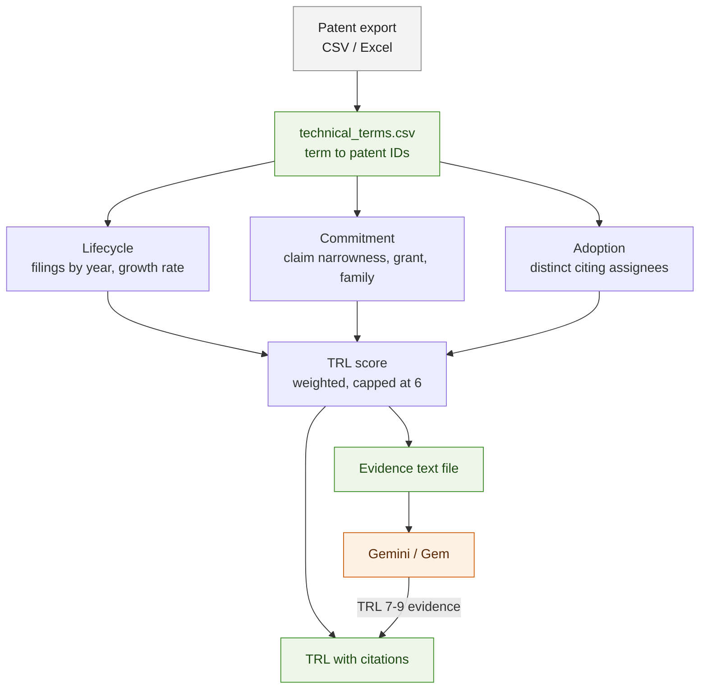

# TRL from a patent export

How to put a Technology Readiness Level on a technology term, given only an
export with abstract, description, claims and patent numbers — and what the
number is and is not worth.

Everything here runs locally on pandas tables. There is no database.

## The short answer

You cannot read TRL out of patent text. The formula has to be built from
**structure and time**, not language, and it has to stop at TRL 6.

```
TRL(T) = clamp( round( 1 + 8 · ( w_L·L(T) + w_C·C(T) + w_A·A(T) ) ), 1, 6 )
```

for a technology term `T` with patent set `P(T)`, where `L`, `C`, `A` are the
lifecycle, commitment and adoption components below, each normalised to
`[0, 1]`, and `w_L + w_C + w_A = 1`.

## Why not language: the measured result

The obvious approach is a maturity lexicon — score a patent by whether it says
"proof of concept", "pilot plant", "prototype", "field trial", "certified",
"commercially available" — and read the TRL ladder off the highest cue.

It does not work, and the failure is not marginal. Nine cue families covering
TRL 1–9 were run over the title, abstract and claims of **400 US battery
patents** (HUPD, `main_cpc` = `H01M`, 327 with usable text):

| | |
|---|---|
| patents firing **no** cue at all | **321 / 327 — 98.2%** |
| total cue hits | 7 |
| hits that were **true** maturity statements | **0** |

All seven were false positives, and reading them shows why the whole approach
is unsound rather than merely under-tuned:

| cue | what it actually matched |
|---|---|
| `theoretical` | "based on a theoretical amount: Li<sub>x</sub>Co…" — stoichiometry |
| `may be employed` | "may be employed as a negative electrode" — claim-scope hedging |
| `may also be used` | same, in a different patent |
| `subsystem` | "a coolant subsystem configured to cool the battery pack" — a part |
| `installed at` | "a switch installed at an upper side" — a spatial relation |
| `coin cell` | "wherein the battery is a coin cell battery" — a product type in a claim |
| `phenomenon` | "the differential electronegativity phenomenon" — physics in a claim |

**The reason is structural, not fixable by a better lexicon.** A patent is
drafted to claim the widest defensible scope. Saying "we built a prototype and
tested it in the field" narrows the claim and dates the invention; saying "may
be employed" widens it. Maturity language is therefore actively drafted *out*
of patents. The words that survive are hedges, and hedges carry no readiness
information.

Treat any tool that reports a TRL from patent phrasing as unvalidated until it
shows its true-positive rate on a corpus this size.

## The three components

Each is a number in `[0, 1]` computed over `P(T)`, the patents containing the
term. All three are orthogonal: one is about *when*, one about *how hard
someone is defending it*, one about *whether anyone else picked it up*.

### L — lifecycle position

Where the term sits on its own patenting S-curve, from the filing-year
histogram the app already computes for the evolution chart.

```
g(T) = filings in the last 3 years / filings in the 3 years before that
s(T) = cumulative filings to date / peak-year run rate × years elapsed
```

| pattern | reading | L |
|---|---|---|
| few filings, `g` ≫ 1 | emerging | 0.1 – 0.3 |
| rising volume, `g` > 1 | growth | 0.3 – 0.6 |
| high volume, `g` ≈ 1 | maturing | 0.6 – 0.8 |
| falling volume, `g` < 1, high `s` | mature or abandoned | 0.8 – 1.0 |

The last row is the ambiguous one and the formula cannot resolve it alone:
filings fall both when a technology is finished and when it is dead. `A`
below is what separates them — a mature technology keeps being cited, an
abandoned one does not.

### C — commitment

How hard the applicants are working to protect a specific built thing, rather
than a broad idea. Averaged over `P(T)`, each sub-signal percentile-normalised
within the corpus:

| signal | direction | measured spread (400 H01M patents) |
|---|---|---|
| independent-claim word count | longer = narrower = defending something specific | p25 **65**, median **102**, p75 **146** words |
| claim count | more = more thoroughly fenced | p25 **3**, median **5**, p75 **10** |
| CPC codes assigned | fewer, more specific = closer to a product | p25 **3**, median **5**, p75 **7** |
| grant status | granted > pending > rejected | 26% accepted, 64% pending, 10% rejected |
| family size / jurisdictions | more countries = commercial intent | *not in this export* |
| continuations / divisionals | sustained investment | *not in this export* |

The first four are computable from a plain USPTO-style export. The last two
need an ORBIT export and are the stronger signals of the six — a family filed
in eight jurisdictions costs real money and is not spent on a TRL-3 idea.

### A — adoption

Whether anyone outside the applicant built on it.

```
A(T) ∝ distinct assignees citing P(T), age-normalised
```

Raw forward-citation counts are the wrong input: a company citing itself is
not adoption. Count **distinct third-party assignees**, and divide by
`(Y_max − Y_filing + 1)` so a 2004 patent is not rewarded merely for being
old. This needs the citing-patents and assignee columns; without them `A` is
undefined and the confidence below must say so.

## Weights, and their honest status

Default `w_L = 0.4`, `w_C = 0.3`, `w_A = 0.3`.

**These are a starting point, not a result.** Nothing here has been calibrated
against expert-assigned TRLs, because no labelled patent set was available.
Until it is, the ordering the formula produces is more trustworthy than the
absolute level: "term A is further along than term B" is defensible, "term A
is at TRL 5" is not.

To calibrate: have an analyst assign TRL to 30–50 terms from one corpus, fit
the three weights by ordinal regression against those labels, and report
Spearman correlation and the confusion matrix across adjacent bands. Under
about 30 labels the fit will not be worth the arithmetic.

## The cap at TRL 6, and what lifts it

The formula clamps to **6**, not 9, deliberately.

TRL 7–9 mean a prototype in an operational environment, a qualified system,
and a system proven in service. None of those events produces a patent. They
produce certifications, datasheets, regulatory filings, tenders, press
releases and product pages. A technology at TRL 9 is often patenting *less*
than it did at TRL 5, because the core claims are already granted and the
remaining work is manufacturing.

So a patent corpus can tell you a technology has reached "demonstrated in a
relevant environment" and cannot tell you whether it shipped. That is exactly
the split the architecture already has: **the local app scores 1–6 from the
export; Gemini is asked to find the deployment evidence that would justify
7–9, and every patent number it cites is checked back against the local
tables.**

## Output contract

A TRL claim is only usable if it carries its evidence. Every row:

```
term, trl, confidence, L, C, A, n_patents, driving_patents, unavailable_fields
```

- `driving_patents` — the publication numbers behind the top component, so any
  number can be traced to a document, the same rule as everywhere else in this
  repo.
- `unavailable_fields` — which of the six `C` signals and two `A` signals were
  missing from the export. A TRL computed without `A` is a different quantity
  and must not be compared against one computed with it.

```
confidence(T) = min(1, N/10) · (fields_available / fields_required) · agreement
```

where `agreement` is `1 −` the normalised spread of the three components: when
`L`, `C` and `A` disagree sharply the term is probably two technologies sharing
a name, and the right response is to split it, not to average it.

Report `N < 5` as "insufficient evidence" and emit no TRL at all.

## Pipeline

Mermaid source: [`diagrams/trl.mmd`](diagrams/trl.mmd).



## What to build first

1. `L` alone, from the evolution data already on screen. It needs no new
   columns and it is the component with the most signal per unit of work.
2. `C` from claim length, claim count, CPC count and grant status — all four
   are in a plain export.
3. `A` only once the export carries citing patents and assignees.

Shipping `L` and `C` with `A` marked unavailable is honest and useful.
Shipping a single number with no components, no confidence and no patent
numbers behind it is not.
